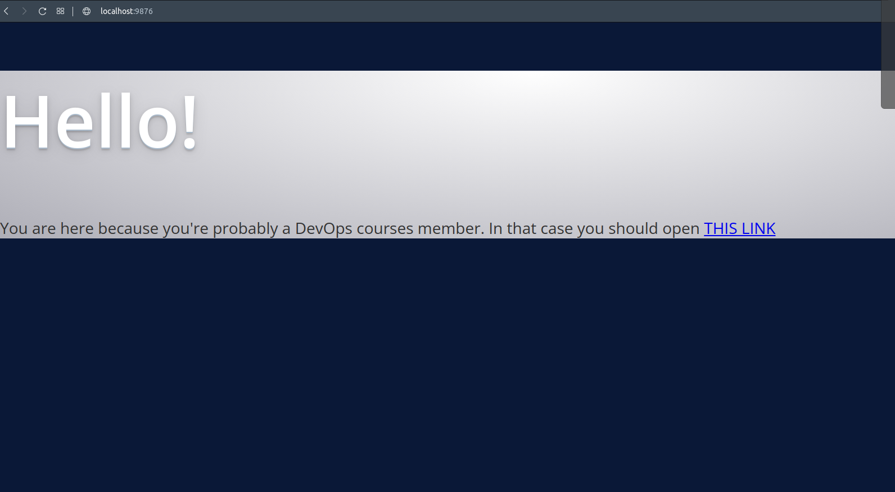

### Task 1:
#### As a result of each point, you should provide a corresponding command.
localhost - your CentOS VM running in VirtualBox
remotehost - 18.221.144.175 (public IP)
webserver - 172.31.45.237 (private IP)
1.1. SSH to remotehost using username and password provided to you in Slack. Log
out from remotehost.
```
[superadmin@localhost ~]$ ssh Aleksandr_Karabchevskiy@18.221.144.175
```
1.2. Generate new SSH key-pair on your localhost with name "hw-5" (keys should be
created in ~/.ssh folder).
```
[superadmin@localhost ~]$ ssh-keygen -f ~/.ssh/hw-5 
```
1.3. Set up key-based authentication, so that you can SSH to  remotehost  without
password.
```
[superadmin@localhost ~]$ ssh-copy-id -i ~/.ssh/hw-5 Aleksandr_Karabchevskiy@18.221.144.175
```
1.4. SSH to remotehost without password. Log out from remotehost.
```
[superadmin@localhost ~]$ ssh -i ~/.ssh//hw-5 Aleksandr_Karabchevskiy@18.221.144.175
```
1.5. Create SSH config file, so that you can SSH to remotehost simply running `ssh
remotehost` command. As a result, provide output of command `cat ~/.ssh/config`.
```
[superadmin@localhost ~]$ cat .ssh/config 
Host remotehost
        HostName 18.221.144.175
        User Aleksandr_Karabchevskiy
        IdentityFile /home/superadmin/.ssh/hw-5
```
1.6. Using command line utility (curl or telnet) verify that there are some webserver
running on port 80 of webserver.  Notice that webserver has a private network IP, so
you can access it only from the same network (when you are on remotehost that runs
in the same private network). Log out from remotehost.
```
[Aleksandr_Karabchevskiy@ip-172-31-33-155 ~]$ curl http://172.31.45.237
```
1.7. Using SSH setup port forwarding, so that you can reach  webserver from your
localhost (choose any free local port you like).
```
[superadmin@localhost ~]$ ssh -L 9876:172.31.45.237:80 remotehost
```
1.8 Like in 1.6, but on localhost using command line utility verify that localhost and
port you have specified act like webserver, returning same result as in 1.6.
```
[superadmin@localhost ~]$ curl http://localhost:9876
```
1.9 (*) Open webserver webpage in browser of your Host machine of VirtualBox
(Windows, or Mac, or whatever else you use). You may need to setup port forwarding
in settings of VirtualBox.
```
superadmin@PipetkyBook:~/epam_devops_data$ ssh -L 9876:172.31.45.237:80 Aleksandr_Karabchevskiy@18.221.144.175
```

### Task 2:
#### Following tasks should be executed on your localhost as you will need root privileges
2.1. Imagine your localhost has been relocated to Havana. Change the time zone on
the localhost to Havana and verify the time zone has been changed properly (may be
multiple commands).
```
[root@localhost superadmin]# timedatectl set-timezone America/Havana
[root@localhost superadmin]# date
Wed Dec 22 09:42:29 CST 2021
```
2.2. Find all systemd journal messages on localhost, that were recorded in the last 50
minutes and originate from a system service started with user id 81 (single command).
```
sudo journalctl --system _UID=81 --since "50min ago"
-- Logs begin at Sat 2021-12-18 05:57:29 CST, end at Wed 2021-12-22 10:09:21 CST. --
Dec 22 09:42:13 localhost.localdomain dbus[653]: [system] Activating via systemd: service name='org.freedesktop.timedate1' unit='dbus-org.freedesktop.timedate1.service'
Dec 22 09:42:13 localhost.localdomain dbus[653]: [system] Successfully activated service 'org.freedesktop.timedate1'
```
2.3. Configure  rsyslogd  by adding  a  rule  to  the  newly created  configuration   file
/etc/rsyslog.d/auth-errors.conf to log all security and authentication messages with the
priority alert and higher to the  /var/log/auth-errors file. Test the newly added log
directive with the logger command (multiple commands).
```
[root@localhost superadmin]# systemctl restart rsyslog
[root@localhost superadmin]# cat /var/log/auth-errors
[root@localhost superadmin]# logger -pauth.alert alert_error
[root@localhost superadmin]# logger -pmail.alert alert_error
[root@localhost superadmin]# logger -pauth.emerg alert_error
[root@localhost superadmin]# 
Broadcast message from systemd-journald@localhost.localdomain (Thu 2021-12-23 05:40:58 CST):

superadmin[4966]: alert_error


Message from syslogd@localhost at Dec 23 05:40:58 ...
 superadmin:alert_error

[root@localhost superadmin]# cat /var/log/auth-errors
Dec 23 05:40:50 localhost superadmin: alert_error
Dec 23 05:40:58 localhost superadmin: alert_error
```